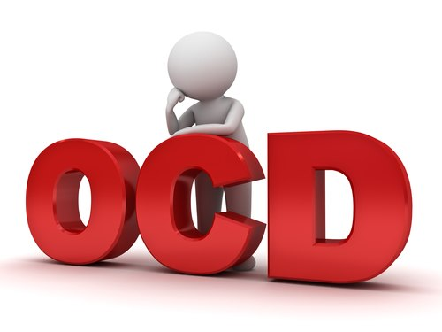

<div id="top"></div>

[![Contributors][contributors-shield]][contributors-url]
[![Forks][forks-shield]][forks-url]
[![Stargazers][stars-shield]][stars-url]
[![Issues][issues-shield]][issues-url]
[![MIT License][license-shield]][license-url]
[![LinkedIn][linkedin-shield]][linkedin-url]


<!-- PROJECT LOGO -->
<br />
<div align="center">
    

  <h3 align="center">A program which simulates how mind and OCD works together</h3>

  <p align="center">
    I try to show how our mind works, helping other people to empathize with us a little more.
    <br />
    <br />
    ·
    <a href="https://github.com/Benrhu/TOC/issues">Report Bug</a>
    ·
    <a href="https://github.com/Benrhu/TOC/issues">Request Feature</a>
  </p>
</div>


<!-- TABLE OF CONTENTS -->
<details>
  <summary>Table of Contents</summary>
  <ol>
    <li>
      <a href="#about-the-project">About The Project</a>
      <ul>
        <li><a href="#built-with">Built With</a></li>
      </ul>
    </li>
    <li>
      <a href="#getting-started">Getting Started</a>
      <ul>
        <li><a href="#prerequisites">Prerequisites</a></li>
        <li><a href="#installation">Installation</a></li>
      </ul>
    </li>
    <li><a href="#usage">Usage</a></li>
    <li><a href="#roadmap">Roadmap</a></li>
    <li><a href="#contributing">Contributing</a></li>
    <li><a href="#license">License</a></li>
    <li><a href="#contact">Contact</a></li>
    <li><a href="#acknowledgments">Acknowledgments</a></li>
  </ol>
</details>


<!-- ABOUT THE PROJECT -->
## About The Project

As you can imagine, I've OCD (Obsessive Compulsive Disorder).

Apparently, I have a normal life. But I have lived situations of all kinds.

Above all, because most people do not understand and do not know how to act, or act in bad faith.

Here's why I developed this:
* Help other people to be more humane
* Learn and improve my TypeScript skills
* If you try and understand the software, you will never reject a person with OCD again

Of course, as I get more knowledge, I will improve this software.

At the moment, this is a console software :)

<p align="right">(<a href="#top">Back to top</a>)</p>


### Built With

This section should list any major frameworks/libraries used to develop this project:

* [TypeScript](https://www.typescriptlang.org/)
* [Deno](https://deno.land)

<p align="right">(<a href="#top">Back to top</a>)</p>


<!-- GETTING STARTED -->
## Getting Started

### Prerequisites

You can run this software easy:
* deno
  ```sh
  deno --allow-net mind.ts
  ```
  
### Installation

_An advantage of Deno is that youdon't need install anything._

1. Clone the repo
   ```sh
   git clone https://github.com/benrhu/ToC.git
   ```
<p align="right">(<a href="#top">Back to top</a>)</p>

<!-- CONTRIBUTING -->
## Contributing

Contributions are what make the open source community such an amazing place to learn, inspire, and create. Any contributions you make are **greatly appreciated**.

If you have a suggestion that would make this better, please fork the repo and create a pull request. You can also simply open an issue with the tag "enhancement".
Don't forget to give the project a star! Thanks again!

1. Fork the Project
2. Create your Feature Branch (`git checkout -b feature/AmazingFeature`)
3. Commit your Changes (`git commit -m 'Add some AmazingFeature'`)
4. Push to the Branch (`git push origin feature/AmazingFeature`)
5. Open a Pull Request

<p align="right">(<a href="#top">Back to top</a>)</p>


<!-- LICENSE -->
## License

Distributed under the MIT License.

<p align="right">(<a href="#top">Bacck to top</a>)</p>

<!-- CONTACT -->
## Contact

Rubén díaz - [@Rubdh89](https://twitter.com/rubdh89) - rubendiaz300000@gmail.com

Project Link: [https://github.com/Benrhu/ToC](https://github.com/Benrhu/ToC)

<p align="right">(<a href="#top">Back to top</a>)</p>

<!-- MARKDOWN LINKS & IMAGES -->
<!-- https://www.markdownguide.org/basic-syntax/#reference-style-links -->
[contributors-shield]: https://img.shields.io/github/contributors/Berhu/ToC.svg?style=for-the-badge
[contributors-url]: https://github.com/Benrhu/ToC/graphs/contributors
[forks-shield]: https://img.shields.io/github/forks/Benrhu/Toc.svg?style=for-the-badge
[forks-url]: https://github.com/Benrhu/ToC/network/members
[stars-shield]: https://img.shields.io/github/stars/Benrhu/ToC.svg?style=for-the-badge
[stars-url]: https://github.com/Benrhu/ToC/stargazers
[issues-shield]: https://img.shields.io/github/issues/Benrhu/ToC.svg?style=for-the-badge
[issues-url]: https://github.com/Benrhu/ToC/issues
[license-shield]: https://img.shields.io/github/license/Benrhu/ToC.svg?style=for-the-badge
[license-url]: https://github.com/Benrhu/ToC/blob/master/LICENSE.txt
[linkedin-shield]: https://img.shields.io/badge/-LinkedIn-black.svg?style=for-the-badge&logo=linkedin&colorB=555
[linkedin-url]: https://linkedin.com/in/rubendiazhuelva